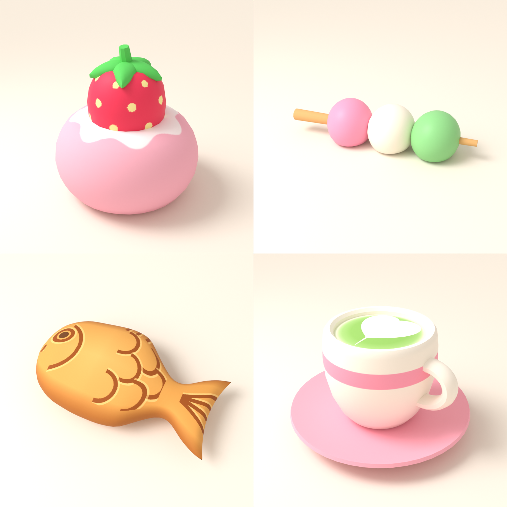
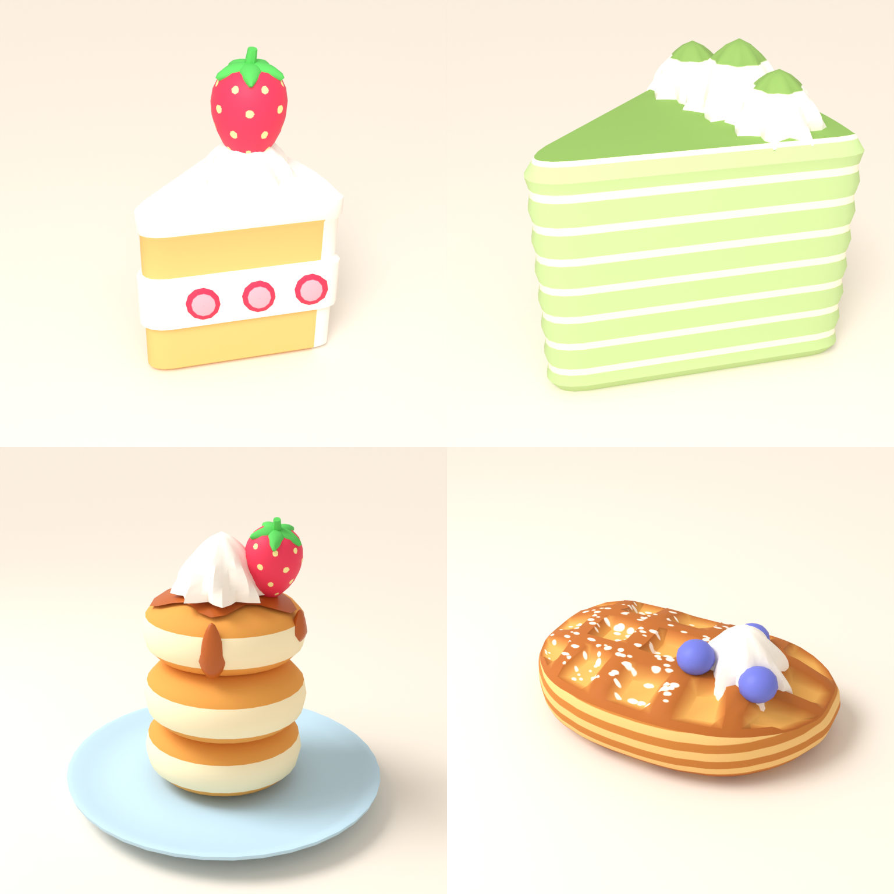
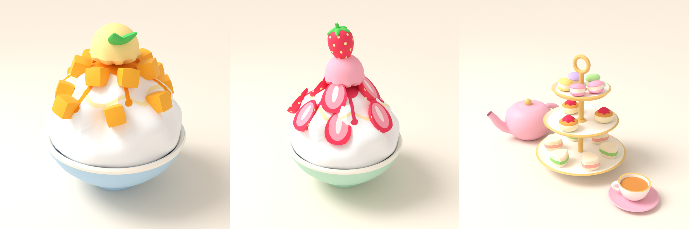
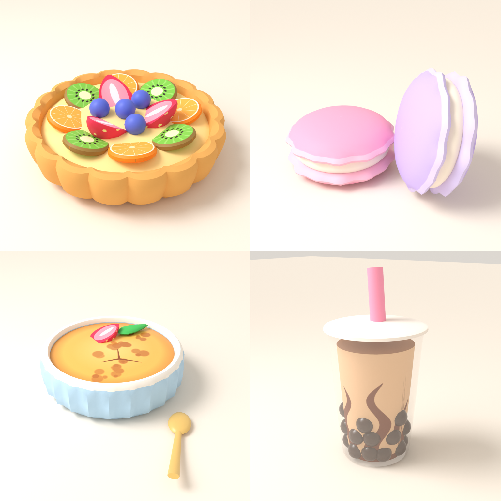

# Roblox Desserts: cozy café food props






Fifteen stylized, pastel, low-poly food props for a Japanese/Korean dessert café.
Every asset is fully generated by a Python script using Blender 5.0 (`bpy`),
so it can be tweaked and rebuilt.

| Asset | Triangles | Size in studs (W × D × H) | Materials | Files |
|---|---|---|---|---|
| StrawberryDaifuku | 2,104 | 1.10 × 1.10 × 1.14 | 3: Mochi, Strawberry, Leaf | `.glb`, `.fbx` |
| Dango | 1,908 | 2.42 × 0.68 × 0.57 | 4: Dango_Pink, Dango_White, Dango_Green, Skewer_Wood | `.glb`, `.fbx` |
| Taiyaki | 3,488 | 1.70 × 0.97 × 0.46 | 1: Taiyaki_Pastry | `.glb`, `.fbx` |
| MatchaLatte | 3,480 | 1.49 × 1.49 × 0.87 | 3: Cup_Ceramic, Saucer_Ceramic, Matcha_Foam | `.glb`, `.fbx` |
| StrawberryShortcake | 4,282 | 0.93 × 0.82 × 1.46 | 5: Sponge, Cream, StrawberrySlice, Strawberry, Leaf | `.glb`, `.fbx` |
| MatchaCrepeCake | 4,494 | 0.88 × 0.77 × 0.93 | 3: CrepeLayers, MatchaTop, Cream | `.glb`, `.fbx` |
| SoufflePancakes | 4,858 | 1.53 × 1.53 × 1.34 | 7: Plate, PancakeGolden, PancakeFluffy, Syrup, Cream, Strawberry, Leaf | `.glb`, `.fbx` |
| Croffle | 3,430 | 1.35 × 0.80 × 0.53 | 4: CroffleWaffle, CroffleLayers, Cream, Blueberry | `.glb`, `.fbx` |
| MangoBingsu | 5,408 | 1.36 × 1.36 × 1.58 | 5: Bowl, ShavedIce, Mango, MangoScoop, Mint | `.glb`, `.fbx` |
| StrawberryBingsu | 6,888 | 1.36 × 1.36 × 1.90 | 6: Bowl, ShavedIce, Strawberry, StrawberryCut, StrawberryScoop, Leaf | `.glb`, `.fbx` |
| AfternoonTeaSet | 9,880 | 2.72 × 1.41 × 1.53 | 5: Porcelain, Gold, PastelCeramic, Pastries, Tea | `.glb`, `.fbx` |
| FruitTart | 5,180 | 1.15 × 1.14 × 0.35 | 6: TartCrust, Custard, FruitSlices, Strawberry, StrawberryCut, Blueberry | `.glb`, `.fbx` |
| Macaron | 4,928 | 1.56 × 1.07 × 0.97 | 3: ShellPink, ShellLavender, Filling | `.glb`, `.fbx` |
| CremeBrulee | 2,628 | 1.28 × 1.15 × 0.33 | 6: Ramekin, CaramelTop, Strawberry, StrawberryCut, Mint, Spoon | `.glb`, `.fbx` |
| BrownSugarMilkTea | 6,532 | 0.96 × 0.96 × 1.81 | 5: CupGlass (semi-transparent), MilkTea, TapiocaPearl, Lid, Straw | `.glb`, `.fbx` |

Each folder has the `.glb`, the `.fbx` (textures embedded), preview renders,
the source textures in `textures/`, and a `REPORT.md` with the re-import
validation results.

## Style

This is a stylized Roblox look, not a product render:

- Exaggerated, chunky proportions: a big strawberry, fat dango, puffy taiyaki,
  and a rolled cup lip, handle and saucer.
- Flat, matte colours with no clearcoat. Textures are flat, with no noise or
  baked gradients. The pastels are slightly saturated but stay soft.
- Only bold detail that reads a few studs away: large seeds, a solid powder
  cap, thick grooves on the taiyaki, one wide cup band and a big foam heart.
- Previews render with Blender's Standard colour transform and soft, even
  lighting, so they're closer to how the textures look in Roblox.

## Conventions

- **Units:** 1 Blender unit = 1 stud. The sizes suit a café table next to a
  standard avatar. If Studio's 3D Importer rescales on import, set the scale
  back so the sizes match the table.
- **Pivot:** bottom centre, so each prop rests on a surface at its origin.
- **Mesh:** one mesh per asset. Each logical material stays a separate
  material slot, and Roblox may split them into sibling MeshParts on import.
- **Colour:** every material has a colour texture, including the flat ones,
  so Roblox always gets a ColorMap. Detail such as the strawberry seeds, the
  mochi powder, the taiyaki scales and the latte-art heart is painted in
  the texture instead of built as tiny geometry.
- **Textures:** 512 px or smaller, so they're mobile-friendly.

## Rebuilding

```bash
pip install bpy            # Blender as a Python module (needs Python 3.11)
python3 RobloxDesserts/scripts/build_strawberry_daifuku.py
python3 RobloxDesserts/scripts/build_dango.py
python3 RobloxDesserts/scripts/build_taiyaki.py
python3 RobloxDesserts/scripts/build_matcha_latte.py
python3 RobloxDesserts/scripts/build_strawberry_shortcake.py
python3 RobloxDesserts/scripts/build_matcha_crepe_cake.py
python3 RobloxDesserts/scripts/build_souffle_pancakes.py
python3 RobloxDesserts/scripts/build_croffle.py
python3 RobloxDesserts/scripts/build_mango_bingsu.py
python3 RobloxDesserts/scripts/build_strawberry_bingsu.py
python3 RobloxDesserts/scripts/build_afternoon_tea.py
python3 RobloxDesserts/scripts/build_fruit_tart.py
python3 RobloxDesserts/scripts/build_macaron.py
python3 RobloxDesserts/scripts/build_creme_brulee.py
python3 RobloxDesserts/scripts/build_brown_sugar_milk_tea.py
```

Each script builds the mesh and exports the `.glb` and `.fbx`. It then renders
the previews, re-imports both files into an empty scene to check the
triangles, materials and textures, and exits non-zero if the check fails.
Shared helpers are in `scripts/dessert_lib.py`. Reusable parts are in
`scripts/cafe_parts.py`: rounded slice lofts, lathes, piped cream and a
strawberry. `scripts/bingsu_common.py` holds the shared bowl, shaved-ice
mound and scoop used by both bingsu. The tea set puts all its small
pastries on one palette-textured material, to keep its material count low.

The milk tea's `CupGlass` material is the only transparent one. Its alpha is
stored in the texture and exported with glTF `alphaMode: BLEND`, and the build
script checks this. If the cup comes into Roblox opaque, set that MeshPart's
`Transparency` to about 0.7. The pearls stick out from the milk tea surface,
so they stay visible either way.
